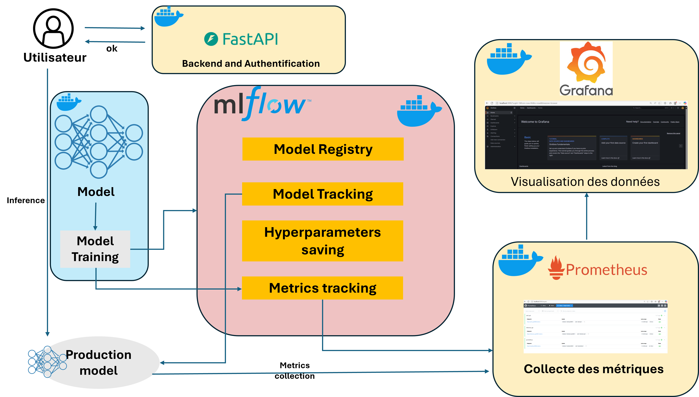
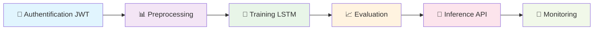
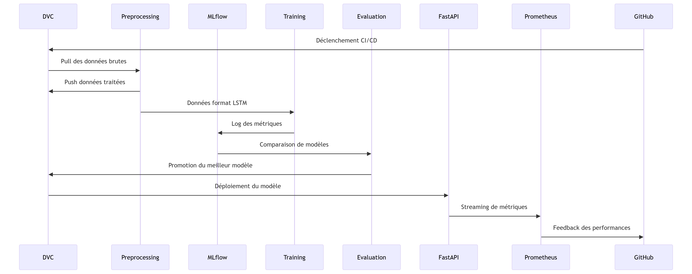
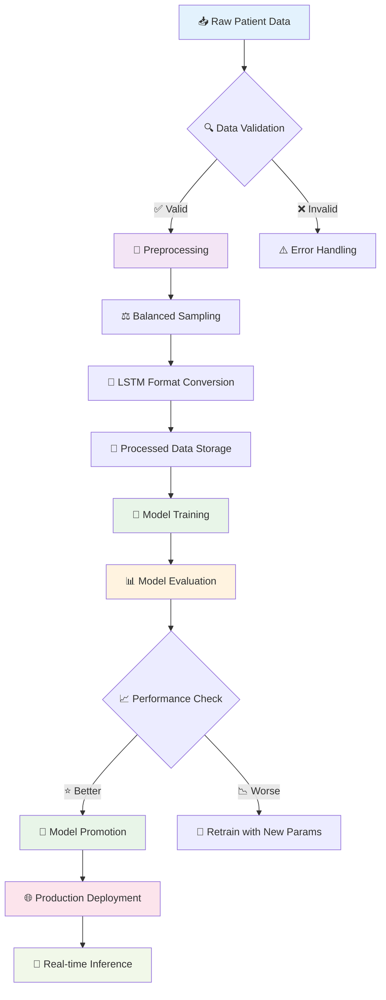
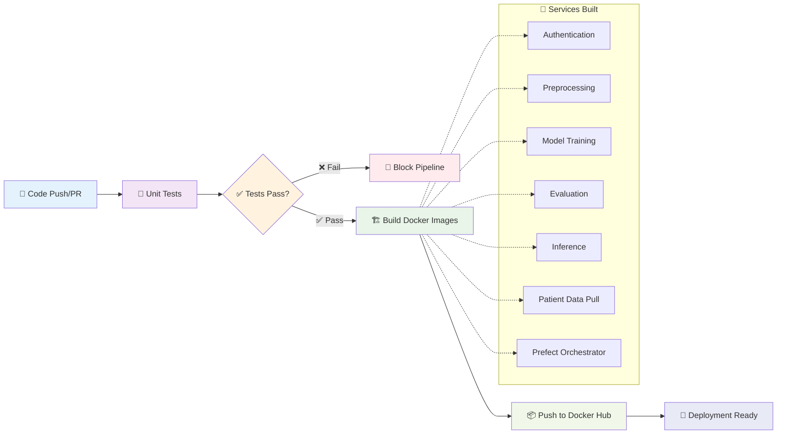
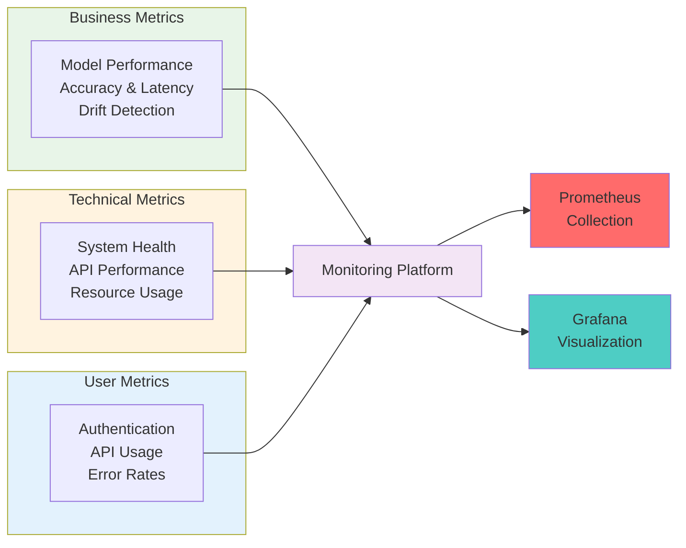

<div style="display: flex; justify-content: center;">
  <h1> 🧠 Projet MLOps Epilepsy Prediction  P</h1>
</div>

[](https://python.org)
[](https://fastapi.tiangolo.com)
[](https://docker.com)
[](https://mlflow.org)
[](https://prometheus.io)
[](https://grafana.com)

*Une plateforme MLOps complète pour la prédiction d'épilepsie avec orchestration automatisée*

[🚀 Démarrage Rapide](#-démarrage-rapide) • [📋 Documentation](#-documentation) • [🏗️ Architecture](#️-architecture) • [🤝 Contribution](#-contribution)

</div>

---

## 🎯 Vue d'ensemble

Cette plateforme a été conçue pour prédire les crises d’épilepsie. Elle applique les bonnes pratiques DevOps et MLOps et utilise des micro-services, ce qui lui assure évolutivité et sécurité.

Le schéma suivant illustre le workflow général, étant donné qu'un utilisateur lance une requete pour faire une prédiction : 




### ✨ Fonctionnalités Clés


## 🗂️ Structure du Projet

```
📁 epilepsy-mlops/
├── 🔧 .github/workflows/          # CI/CD Pipeline
│   └── ci-cd.yml
├── 📊 monitoring/                 # Prometheus & Grafana configs
│   ├── prometheus/
│   └── grafana/
├── 🐳 services/                   # Microservices
│   ├── 🔐 authentication/        # JWT Auth API
│   ├── 📊 preprocessing/          # Data Pipeline
│   ├── 🤖 model_training/         # LSTM Training
│   ├── 📈 evaluation/             # Model Evaluation
│   ├── 🚀 inference/              # Prediction API
│   └── 📋 patient_data_pull/      # Data Extraction
├── 🧪 tests/                      # Test Suite
│   ├── unit/
├── 📦 data/                       # Data Management
│   ├── raw/
│   ├── processed/
│   └── models/
├── ⚡ orchestration/              # Prefect Workflows
│   └── flows/
├── 🐳 docker-compose.yml          # Container Orchestration
├── 📋 requirements.txt            # Dependencies
└── 📚 docs/                       # Documentation
```
## 🏗️ Architecture Système

### Infrastructure MLOps

Le schéma suivant détaille le workflow MLOPS utilisé : 



### Pipeline de Données



## 🚀 Démarrage Rapide

### Prérequis

```bash
# Versions requises
Python >= 3.10
Docker >= 20.10
Docker Compose >= 2.0
Git >= 2.30
```

### Installation Express

```bash
# 1️⃣ Cloner le repository
cd epilepsy-mlops

# 2️⃣ Configuration de l'environnement
python -m venv virtmlops

virtmlops\Scripts\activate (windows)

# 3️⃣ Batir les images
docker-compose build

# 4️⃣ Initialiser les données
dvc pull

# 5️⃣ Démarrer l'infrastructure
docker-compose up -d
```

### Accès aux Services

| Service | URL | Description |
|---------|-----|-------------|
| 🔐 Authentication | `http://localhost:8000` | API d'authentification JWT |
| 🚀 Inference API | `http://localhost:8001` | Prédictions en temps réel |
| 🔬 MLflow UI | `http://localhost:5000` | Suivi des expériences |
| 📊 Prometheus | `http://localhost:9090` | Métriques système |
| 📈 Grafana | `http://localhost:3000` | Dashboards de monitoring |
| ⚡ Prefect UI | `http://localhost:4200` | Orchestration des workflows |

## 🔄 Pipeline CI/CD

### GitHub Actions Workflow



## 📊 Monitoring & Observabilité



---

<div align="center">


</div>

---

