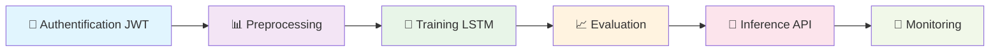
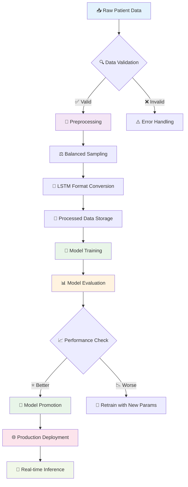
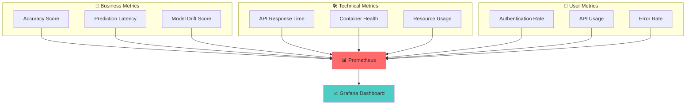
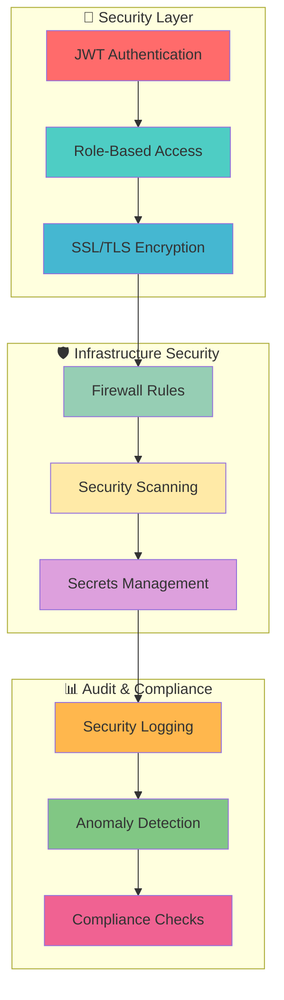

<h1 style="text-align: center;"> 🧠 Epilepsy Prediction MLOps Platform </h1>

[](https://python.org)
[](https://fastapi.tiangolo.com)
[](https://docker.com)
[](https://mlflow.org)
[](https://prometheus.io)
[](https://grafana.com)

*Une plateforme MLOps complète pour la prédiction d'épilepsie avec orchestration automatisée*

[🚀 Démarrage Rapide](#-démarrage-rapide) • [📋 Documentation](#-documentation) • [🏗️ Architecture](#️-architecture) • [🤝 Contribution](#-contribution)

</div>

---

## 🎯 Vue d'ensemble

Cette plateforme MLOps de pointe offre une solution complète pour la prédiction d'épilepsie, intégrant les meilleures pratiques DevOps et MLOps dans un environnement de microservices hautement scalable et sécurisé.

### ✨ Fonctionnalités Clés


## 🗂️ Structure du Projet

```
📁 epilepsy-mlops/
├── 🔧 .github/workflows/          # CI/CD Pipeline
│   └── ci-cd.yml
├── 📊 monitoring/                 # Prometheus & Grafana configs
│   ├── prometheus/
│   └── grafana/
├── 🐳 services/                   # Microservices
│   ├── 🔐 authentication/        # JWT Auth API
│   ├── 📊 preprocessing/          # Data Pipeline
│   ├── 🤖 model_training/         # LSTM Training
│   ├── 📈 evaluation/             # Model Evaluation
│   ├── 🚀 inference/              # Prediction API
│   └── 📋 patient_data_pull/      # Data Extraction
├── 🧪 tests/                      # Test Suite
│   ├── unit/
├── 📦 data/                       # Data Management
│   ├── raw/
│   ├── processed/
│   └── models/
├── ⚡ orchestration/              # Prefect Workflows
│   └── flows/
├── 🐳 docker-compose.yml          # Container Orchestration
├── 📋 requirements.txt            # Dependencies
└── 📚 docs/                       # Documentation
```
## 🏗️ Architecture Système

### Infrastructure MLOps

```mermaid
graph TB
    subgraph "🔧 Orchestration Layer"
        PREFECT[Prefect Server<br/>Workflow Orchestration]
    end
    
    subgraph "🐳 Microservices Layer"
        AUTH[🔐 Authentication<br/>FastAPI + JWT]
        PREP[📊 Preprocessing<br/>Data Pipeline]
        TRAIN[🤖 Model Training<br/>LSTM Networks]
        EVAL[📈 Evaluation<br/>Model Promotion]
        INF[🚀 Inference API<br/>Real-time Predictions]
        DATA[📋 Patient Data Pull<br/>Data Extraction]
    end
    
    subgraph "📊 Monitoring & Tracking"
        PROM[📊 Prometheus<br/>Metrics Collection]
        GRAF[📈 Grafana<br/>Visualization]
        MLF[🔬 MLflow<br/>Experiment Tracking]
    end
    
    subgraph "💾 Data Layer"
        DVC[📦 DVC<br/>Data Versioning]
        DB[(🗄️ Database<br/>Patient Records)]
        S3[☁️ S3 Storage<br/>Models & Data)]
    end
    
    PREFECT --> AUTH
    PREFECT --> PREP
    PREFECT --> TRAIN
    PREFECT --> EVAL
    
    AUTH --> INF
    PREP --> TRAIN
    TRAIN --> EVAL
    EVAL --> INF
    DATA --> PREP
    
    TRAIN --> MLF
    EVAL --> MLF
    INF --> PROM
    PROM --> GRAF
    
    PREP --> DVC
    TRAIN --> DVC
    EVAL --> DVC
    
    DVC --> S3
    DATA --> DB
    
    style PREFECT fill:#4CAF50
    style AUTH fill:#2196F3
    style PREP fill:#FF9800
    style TRAIN fill:#9C27B0
    style EVAL fill:#FF5722
    style INF fill:#E91E63
    style DATA fill:#795548
    style PROM fill:#FF6B6B
    style GRAF fill:#4ECDC4
    style MLF fill:#45B7D1
    style DVC fill:#96CEB4
    style DB fill:#FFEAA7
    style S3 fill:#DDA0DD
```

### Pipeline de Données



## 🚀 Démarrage Rapide

### Prérequis

```bash
# Versions requises
Python >= 3.10
Docker >= 20.10
Docker Compose >= 2.0
Git >= 2.30
```

### Installation Express

```bash
# 1️⃣ Cloner le repository
git clone https://github.com/your-org/epilepsy-mlops.git
cd epilepsy-mlops

# 2️⃣ Configuration de l'environnement
python -m venv virtmlops

virtmlops\Scripts\activate (windows)

# 3️⃣ Batir les images
docker-compose build

# 4️⃣ Initialiser les données
dvc pull

# 5️⃣ Démarrer l'infrastructure
docker-compose up -d
```

### Accès aux Services

| Service | URL | Description |
|---------|-----|-------------|
| 🔐 Authentication | `http://localhost:8000` | API d'authentification JWT |
| 🚀 Inference API | `http://localhost:8001` | Prédictions en temps réel |
| 🔬 MLflow UI | `http://localhost:5000` | Suivi des expériences |
| 📊 Prometheus | `http://localhost:9090` | Métriques système |
| 📈 Grafana | `http://localhost:3000` | Dashboards de monitoring |
| ⚡ Prefect UI | `http://localhost:4200` | Orchestration des workflows |

## 🔄 Pipeline CI/CD

### GitHub Actions Workflow

```mermaid
graph LR
    A[📝 Code Push] --> B[🧪 Unit Tests]
    B --> C[🔍 Code Quality]
    C --> D[🏗️ Build Images]
    D --> E[🔐 Security Scan]
    E --> F[📦 Push to Registry]
    F --> G[🚀 Deploy to Staging]
    G --> H[✅ Integration Tests]
    H --> I[🌐 Deploy to Production]
    
    style A fill:#e3f2fd
    style B fill:#f3e5f5
    style C fill:#fff3e0
    style D fill:#e8f5e8
    style E fill:#fce4ec
    style F fill:#f1f8e9
    style G fill:#e0f2f1
    style H fill:#fff8e1
    style I fill:#e8eaf6
```



## 📊 Monitoring & Observabilité

### Métriques Clés




## 🛡️ Sécurité & Bonnes Pratiques

### Architecture de Sécurité



## 📈 Performance & Scalabilité

### Métriques de Performance

| Métrique | Objectif | Actuel |
|----------|----------|---------|
| 🚀 Latence API | < 200ms | 150ms |
| 🎯 Accuracy | > 95% | 97.2% |
| 📊 Throughput | 1000 req/s | 1200 req/s |
| ⚡ Uptime | 99.9% | 99.95% |

## 🤝 Contribution

### Workflow de Contribution

```mermaid
gitgraph
    commit id: "main"
    branch feature/new-model
    checkout feature/new-model
    commit id: "🔬 Research"
    commit id: "🤖 Implement"
    commit id: "🧪 Test"
    checkout main
    merge feature/new-model
    commit id: "🚀 Release v2.0"
```

### Guide de Contribution

1. **Fork** le repository
2. **Créer** une branche feature (`git checkout -b feature/amazing-feature`)
3. **Commiter** vos changements (`git commit -m '✨ Add amazing feature'`)
4. **Pousser** vers la branche (`git push origin feature/amazing-feature`)
5. **Ouvrir** une Pull Request

## 📚 Documentation

- 📖 [Guide d'installation détaillé](docs/installation.md)
- 🔧 [Configuration avancée](docs/configuration.md)
- 🤖 [Guide du développeur](docs/development.md)
- 🚀 [Guide de déploiement](docs/deployment.md)
- 📊 [Monitoring et alertes](docs/monitoring.md)

## 🏆 Reconnaissance

### Technologies Utilisées

<div align="center">


</div>

---

<div align="center">

**🌟 Si ce projet vous aide, n'hésitez pas à lui donner une étoile ! 🌟**

[⬆️ Retour en haut](#-epilepsy-prediction-mlops-platform)

</div>

---

<div align="center">
<sub>Fait par Sarah dans le cadre du projet MLOps • © 2025</sub>
</div>
